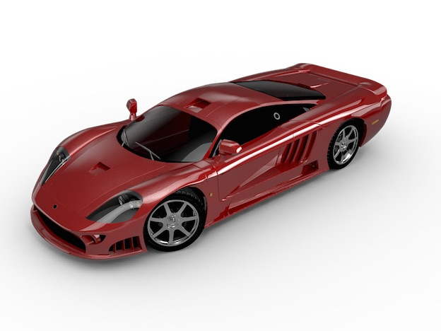
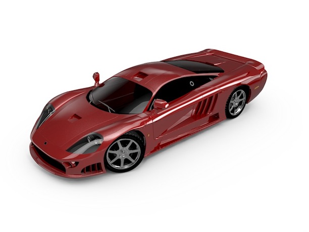
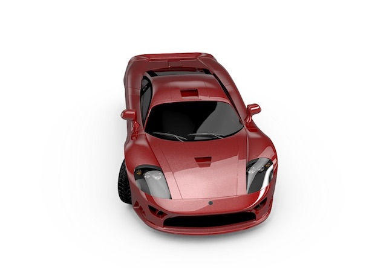

# image-sequence-streaming

Realtime, non-linear animation playback for interactive pieces. 

## What are image sequences?

Image sequences are very similar video files, but are designed to be accessed randomly, so frames can be played back in any order you would like. This makes them very useful for creating interactive content, such as draggable animations composed from many individual images (frames). 

On mobile devices image sequences are a powerful tool for creating interactive content with outstanding visual quality. For example, creating a rotatable 3D product display:




## What is sequence streaming?

Most image sequence approaches out there (using UIImageView or custom CGImage code) require the entire animation, or many frames, to be loaded into memory at once. This method has several difficult drawbacks:
- Long load times.
- Large memory footprint.
- Limitations on animation length
- Slow playback speeds

This project aims to overcome these limitations by streaming individual frames into memory, as needed. This approach has several advantageous:
- No load times.
- Constant small memory footprint (a few frames at most) regardless of sequence length.  
- Nearly unlimited sequence length.
- Smooth framerates (Often 30-60 FPS which is faster than conventional video playback)
- Scaling playback - lower resolution animations can be displayed in a larger view improve performance and reduce data size.

The main tradeoff for this approach, is that a collection of JPEGs need to be precompiled into a single file using a command line tool. Thanks to JPEGs effecient compression, the filesizes are very small. 

## Usage:

Compiling a folder of JPEGs into a sequence file in terminal:

```
sequencebuild folder_of_jpgs/ output.seq
```

Loading a sequence file:

```Objective-C
ISSequence* sequence = [ISSequence sequenceNamed:@"sequence.seq"];

```

Creating a draggable interactive playback view:

```Objective-C
ISSequenceDragView* view = [[ISSequenceDragView alloc] initWithSequence:sequence
                                                        refreshInterval:2 /* 30 FPS refresh rate */
                                                        useTextureCache:YES /* texture cache is an optional core video optimization */
                                                                  loops:YES
                                                                  range:[sequence range]
                                                          dragDirection:kISSequnceDragDirectionHorizontal
                                                        dragSensitivity:2.0
                                                               delegate:nil];

[self addSubview:view];

```

Creating a grid position playback view:

```Objective-C

/*
 when touch is enabled for grid view touches cause the view to load the grid cell nearest to the touch
 */

ISSequenceGridView* view = [[ISSequenceGridView alloc] initWithSequence:sequence
                                                        refreshInterval:2
                                                        useTextureCache:YES
                                                                  range:[sequence range]
                                                           framesPerRow:21
                                                           touchEnabled:YES];


[self addSubview:view];

```

**Note:** Simulator performance is not a good indicator of device performance in general, and especially in this project. Always be sure to test on device.


### Components:
- A macOS command line tool for compiling a collection of JPEG images into an optimized sequence file. (sequencebuild)
- A C module for working with sequence files. (ISSequenceStream)
- An Objective-C class for working with sequence files. (ISSequence)
- UIView base class for displaying interactive sequences with OpenGL ES and Core Video.
- Interactive UIView classes for linear playback, horizontal and vertical drag control, and grid cell control, (ISSequenceView...)
- An example project and sample animation sequence.


## Credits:

 Thanks to my friend **Steve Glauser** for creating and rendering the sample image sequence.

## Example:

Due to filesize the resolution of the sample animation included in this project has been limited. The original resolution was reduced from 1024x768 to 960x720 and every other frame was removed. In your own apps you can safely expect to display higher quality animations.





## Project License

MIT License

Copyright (c) 2017 Justin Meiners

Permission is hereby granted, free of charge, to any person obtaining a copy of this software and associated documentation files (the "Software"), to deal in the Software without restriction, including without limitation the rights to use, copy, modify, merge, publish, distribute, sublicense, and/or sell copies of the Software, and to permit persons to whom the Software is furnished to do so, subject to the following conditions:

The above copyright notice and this permission notice shall be included in all copies or substantial portions of the Software.

THE SOFTWARE IS PROVIDED "AS IS", WITHOUT WARRANTY OF ANY KIND, EXPRESS OR IMPLIED, INCLUDING BUT NOT LIMITED TO THE WARRANTIES OF MERCHANTABILITY, FITNESS FOR A PARTICULAR PURPOSE AND NONINFRINGEMENT. IN NO EVENT SHALL THE AUTHORS OR COPYRIGHT HOLDERS BE LIABLE FOR ANY CLAIM, DAMAGES OR OTHER LIABILITY, WHETHER IN AN ACTION OF CONTRACT, TORT OR OTHERWISE, ARISING FROM, OUT OF OR IN CONNECTION WITH THE SOFTWARE OR THE USE OR OTHER DEALINGS IN THE SOFTWARE.

